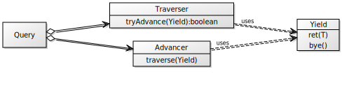
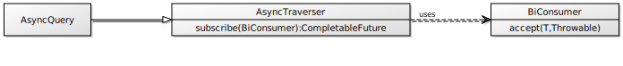

# JAYield

[](https://sonarcloud.io/dashboard?id=com.tinyield%3Ajayield)
[](https://sonarcloud.io/dashboard?id=com.tinyield%3Ajayield)
[](https://search.maven.org/artifact/com.tinyield/jayield)

_Minimalistic_, _extensible_, _non-parallel_ and _lazy_ sequence implementation interoperable with Java
`Stream` (`toStream` and `fromStream`), which provides an idiomatic `yield` like _generator_.

JAYield `Query` provides similar operations to Java `Stream`, or
[jOOλ][18] `Seq`, or [StreamEx][16], or [Vavr][19] Stream. 
Yet, `Query` is **extensible** and its methods can be [chained
fluently](#extensibility-and-chaining) with new operations in a pipeline.
Furthermore, `Query` has lower per-element access cost and offers an optimized
fast-path traversal, which presents better sequential processing performance in
some benchmarks, such as [sequences-benchmarks][20] and [jayield-jmh][21].

The core API of `Query` provides well-known query methods that can be 
composed fluently (_pipeline_), e.g.:

```java
// pipeline: iterate-filter-map-limit-forEach
//
Query.iterate('a', prev -> (char) ++prev).filter(n -> n%2 != 0).map(Object::toString).limit(10).forEach(out::println);
```


## Extensibility and chaining

Notice how it looks a JAYield custom `collapse()` method that merges series of adjacent elements.
It has a similar shape to that one written in any language providing the `yield` feature
such as Kotlin.

<table class="table">
    <tr class="row">
        <td>

```java
class Queries {
  private U prev = null;
  <U> Traverser<U>  collapse(Query<U> src) {
    return yield -> {
      src.traverse(item -> {
        if (prev == null || !prev.equals(item))
        yield.ret(prev = item);
      });
    };
  }
}
```

</td>
<td>

```kotlin
fun <T> Sequence<T>.collapse() = sequence {
    var prev: T? = null
    val src = this@collapse.iterator()
    while (src.hasNext()) {
        val aux = src.next()
        if (aux != null && aux != prev) {
            prev = aux
            yield(aux)
        }
    }
}
```

</td>
</tr>
</table>

These methods can be chained in queries, such as:

<table class="table">
    <tr class="row">
        <td>

```java
Query
    .of(7, 7, 8, 9, 9, 8, 11, 11, 9, 7)
    .then(new Queries()::collapse)
    .filter(n -> n%2 != 0)
    .map(Object::toString)
    .traverse(out::println);

```

</td>
<td>

```kotlin
sequenceOf(7, 7, 8, 9, 9, 8, 11, 11, 9, 7)
    .collapse()
    .filter { it % 2 != 0 }
    .map(Int::toString)
    .forEach(::println)
```

</td>
</tr>
</table>

## Internals Overview

`Traverser` is the primary choice for traversing the `Query` elements in bulk and 
supports all its methods including _terminal_, _intermediate_ and _short-circuting_
operations.
To that end, the traversal's consumer - `Yield` - provides one method to return
an element (`ret`) and other to finish the iteration (`bye`).
`Advancer` is the alternative iterator of `Query` that provides individually traversal.



It also supports asynchronous processing through its counterpart `AsyncQuery` and 
corresponding `AsyncTraverser`.
An `AsyncTraverser` is subscribed with a `BiConsumer<T, Throwable>` that receives items or
error on failure.
We may track the traversal completion through the `CompletableFuture<Void>` returned by the
`subscribe()` method.



For instance, getting the 3 top tracks for the following artists (i.e. _Muse_,
_Cure_ and _Radiohead_) with a non-blocking approach may be achieved with the
next operations chain:

<table>
    <tr>
        <td align="center">
          In <a href="https://github.com/tinyield/jayield/blob/development/src/test/java/org/jayield/async/AsyncQueryTest.java#L40" target="_blank">
            AsyncQueryTest.java
          </a>
        </td>
        <td align="center">
          Output
        </td>
    </tr>
    <tr>
    <td>

```java
AsyncQuery
  .of("muse", "cure", "radiohead")      // AsyncQuery<String>
  .map(artist -> topTracks(artist, 3))  // AsyncQuery<CF<Track[]>>
  .flatMapMerge(AsyncQuery::of)         // AsyncQuery<Track[]>
  .flatMapMerge(AsyncQuery::of)         // AsyncQuery<Track>
  .subscribe((track, err) -> {
      if(err != null) out.println(err);
      else out.println(track.getName());
  })
  .join(); // block if you want to wait for completion
```

</td>
<td>
<blockquote>
<small>
Creep<br>
Supermassive Black Hole<br>
Starlight<br>
Friday I'm in Love<br>
Just Like Heaven<br>
Time Is Running Out<br>
Karma Police<br>
Boys Don't Cry<br>
Paranoid Android<br>
</small>
</blockquote>
</td>
</tr>
</table>

## Installation

In order to include it to your Maven project, simply add this dependency:

```xml
<dependency>
    <groupId>com.tinyield</groupId>
    <artifactId>jayield</artifactId>
    <version>1.5.1</version>
</dependency>
```

You can also download the artifact directly from [Maven
Central Repository](https://repo.maven.apache.org/maven2/com/tinyield/jayield/)


## License

This project is licensed under [Apache License,
version 2.0](https://www.apache.org/licenses/LICENSE-2.0)

[16]: https://github.com/amaembo/streamex
[18]: https://github.com/jOOQ/jOOL
[19]: https://github.com/vavr-io/vavr
[20]: https://github.com/tinyield/sequences-benchmarks
[21]: https://github.com/jayield/jayield-jmh
