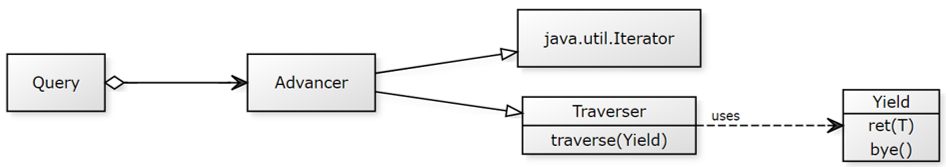

# JAYield

[](https://sonarcloud.io/dashboard?id=com.github.jayield%3Ajayield)
[](https://sonarcloud.io/component_measures?id=com.github.jayield%3Ajayield&metric=Coverage)
[](https://maven-badges.herokuapp.com/maven-central/com.github.jayield/jayield)

A minimalistic extensible lazy sequence implementation interoperable with Java
`Stream` (`toStream` and `fromStream`), which provides an idiomatic `yield` like generator
without support for parallelization.

Simply put, the JAYield `Query` provides similar operations to Java `Stream`, or
[jOOλ][18] `Seq`, or [StreamEx][16], or [Vavr][19] Stream. 
Yet, `Query` has lower per-element access cost and offers an optimized fast-path traversal, which presents better sequential processing performance in some benchmarks, such as [sequences-benchmarks][20] and [jayield-jmh][21].

The core API of `Query` provides well-known query method that allow the
composition of pipelines, such as `iterate-filter-map-limit-forEach`:

```java
Query.iterate('a', prev -> (char) ++prev).filter(n -> n%2 != 0).map(Object::toString).limit(10).forEach(out::println);
```

But `Query` has also the advantage of being extensible with new operations that can be
fluently interleaved in a pipeline.

Notice how it looks a JAYield custom `collapse()` method that merges series of adjacent elements.
It has a similar shape to that one written in any language providing the `yield` operator
such as C\#.

<table class="table">
    <tr class="row">
        <td>

```java
private Object prev = null;
<U> Traverser<U>  collapse(Query<U> src) {
  return yield -> {
    src.traverse(item -> {
      if (prev == null || !prev.equals(item))
      yield.ret((U) (prev = item));
    });
  };
}
```

</td>
<td>

```csharp
IEnumerable <T> Collapse <T>(this IEnumerable <T> src) {
  IEnumerator <T> iter = src. GetEnumerator ();
  T prev = null;
  while(iter.MoveNext ()) {
    if(prev == null || !prev.Equals(iter.Current ))
    yield return prev = iter.Current;
  }
}
```

</td>
</tr>
</table>

This method can be chained in a query like this:

<table class="table">
    <tr class="row">
        <td>

```java
Query
    .of(7, 7, 8, 9, 9, 8, 11, 11, 9, 7)
    .then(this::collapse)
    .filter(n -> n%2 != 0)
    .map(Object::toString)
    .traverse(out::println);

```

</td>
<td>

```csharp
new int[]{7, 7, 8, 9, 9, 8, 11, 11, 9, 7}
    .Collapse()
    .Where(n => n%2 != 0)
    .Select(n => n.ToString())
    .ToList()
    .ForEach(Console.WriteLine
```

</td>
</tr>
</table>

## Internals Overview

`Advancer` is the core iterator of `Query` that provides both individually and
bulk traversal, trough `java.util.Iterator` and `Traverser` interfaces.
`Traverser` is the primary choice for traversing the `Query` elements and 
supports all its methods including terminal, intermediate and short-circuting
operations.
To that end, the traversal's consumer provides one method to return an element
(`ret()`) and other to finish the iteration (`bye`).



## Installation

In order to include it to your Maven project, simply add this dependency:

```xml
<dependency>
    <groupId>com.github.jayield</groupId>
    <artifactId>jayield</artifactId>
    <version>1.0.4</version>
</dependency>
```

You can also download the artifact directly from [Maven
Central Repository](http://repo1.maven.org/maven2/com/github/jayield/jayield/)


## License

This project is licensed under [Apache License,
version 2.0](https://www.apache.org/licenses/LICENSE-2.0)

[16]: https://github.com/amaembo/streamex
[18]: https://github.com/jOOQ/jOOL
[19]: https://github.com/vavr-io/vavr
[20]: https://github.com/tinyield/sequences-benchmarks
[21]: https://github.com/jayield/jayield-jmh